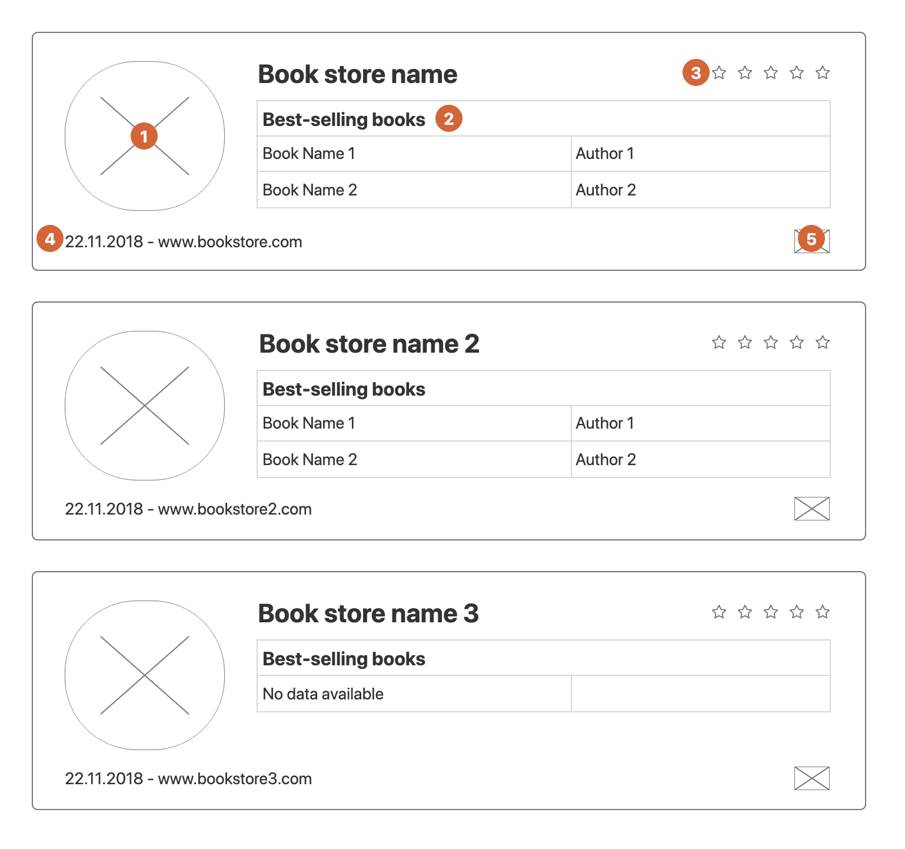

## Anonymous Frontend Coding Challenge

The task is to create an APP that lists the best selling books for each book store. 

This repo contains a JSON:API based application which provides the data for the book stores. This API can be found in the `packages/book-store-api` folder. Within the section below you will find more information on how to run/use `book-store-api`.

Your goal is to present the data (that you receive from the API) as shown in the wireframe:

#### Each circle marker represents specific task:
1. Circle with the Book store image.
2. List with a maximum of 2 books ordered by the number of copies sold. In case that there are no books, please display a "No data available" message.
3. Book store rating represented in stars. The interaction with the rating should update it's correspondent entry in the API.
4. Book store establishment date in DD/MM/YYYY format and website link. The API will return the date in ISO 8601 format.
5. Book store country flag image. The Book store API will only return a 2-letter ISO 3166-1 country code. Please use https://flagcdn.com/ to get the flag image for each country by code to display. 

### Book Store API

JSON:API is a specification on how a client should perform requests that fetch or modify resources, and how a server should respond to those requests.
You can find the JSON:API documentation on this link https://jsonapi.org/format/ but we will explain you some of the basics here to make it easier for you. 

The Book store API contains the `stores`, `books`, `countries` and `authors` resources. Each of the resources can have a attributes object and a relationships object describing relationships between the resource and other resources.

**Breakdown of resources and their relationships:** 

- Stores
    - Attributes:
        - `name`
        - `website`
        - `rating`
        - `image`
        - `establishmentDate`
    - Relationships
        - `books`
        - `countries`
- Books
    - Attributes:
        - `name`
        - `copiesSold`
    - Relationships
        - `authors`
- Countries
    - Attributes:
        - `code`
- Authors
    - Attributes:
        - `fullName`
        
The API endpoint that you will need for most of the tasks is: `http://localhost:3000/json-api/book-store/v1/`. This endpoint will return all store resources and related resources within `included` array.
If you need any other endpint, check the JSON:API specification. 

#### Running API:
- Clone this repo locally
- Install the 'yarn' package manager globally if not already installed (see: https://classic.yarnpkg.com/en/docs/install)  
- CD into 'packages/boot-store-api and run `yarn` or `yarn install` to fetch package.json dependencies.
- CD into 'packages/boot-store-api' and run `yarn dev` to start the fake-json server listener.

#### Rules
- You can choose between Backbone and React as your main framework.
- The project startup procedure must be documented.
- Javascript should be written in ES6 or above.
- GIT history must be clean.
- Application presentation must be done by responsive web design principles.
- Write CSS from scratch, please do not use Bootstrap and similar.

## Addendum

### Solution Updates
Author - Dominick Moré
Subject - Rules
 - project startup has been updated.
 - changes in the 'book-store-api' package.json includes {'type': 'module'} to use directive import instead of require.
 - added eslint `yarn lint` and prettier `yarn fixlint` with env es2020 to parse dynamic imports inside expressions and {'type': 'module'} compliance.
 - 'book-store-ui' project solution built on react 16.8 functional components using react hooks to manage component contexts/state as react/tsx.
 - in 'book-store-ui' added es6 target, strictNullChecks tsconfig.json
 - in 'book-store-ui' project added webpack 4 tsx -> babel es6 transpilation with runtime-corejs3, css postprocessing, bundle optimisation.
 - in 'book-store-ui' postcss processing includes autoprefixer and sanitize.css, otherwise plain css stylesheets.
 - in 'book-store-ui' css layout techniques are realized using flex or grid directives.
 - in 'book-store-ui' responsive design decisions include a media layout for screen widths greater than 640px and one for smaller screen widths.
 - in 'book-store-ui' design decision was to pick a well tested JavaScript/TypeScript json-api client implementation which performs the client
 fake-api-server CRUD operation requests according to json-api specification (including query filter, sort, limit and update).
 - in 'book-store-ui' added @testing-library/jest-dom, @testing-library/react rudimentary functional component unit tests.
Author - Dominick Moré
Subject - Issues to Contend With
 Orbit framework (see https://orbitjs.com/) was chosen as a promising json-api client/server library which provided the basic requirements for
 CRUD operations and more advanced requirements in the future. It supports local and remote json-api sources which can synced with either other
 as a blocking or non-blocking transaction. In the initial orbit coordinator configuration a memory and remote source were configured with all
 request queues blocking. This had the unintended side effect that when the server backend was not available, the memory mutation could not be
 performed unless the remote mutation was successful. This can be observed by starting the 'packages/book-store-api' fake server listener and
 'packages/book-store-ui' webpack dev server independently with `yarn dev`. By changing the remote request queues to non-blocking, the memory
 store can be updated independent of the outcome of the synchronizing remote request queue task. When an error occurs processing the remote
 source request queue the blockage must be remediated by either replacing or removing the failing task in the queue. Remediatory actions are
 orchestrated by the relevant source event callback subscriptions. When a failed remote request is requeued an attempt to process the remote
 task queue is scheduled in 15 seconds. When the remote request task queue is successfully emtied, the local memory and remote sources are in
 sync, otherwise the failing task is requeued and processing of the remote task queue is rescheduled again.  

                

